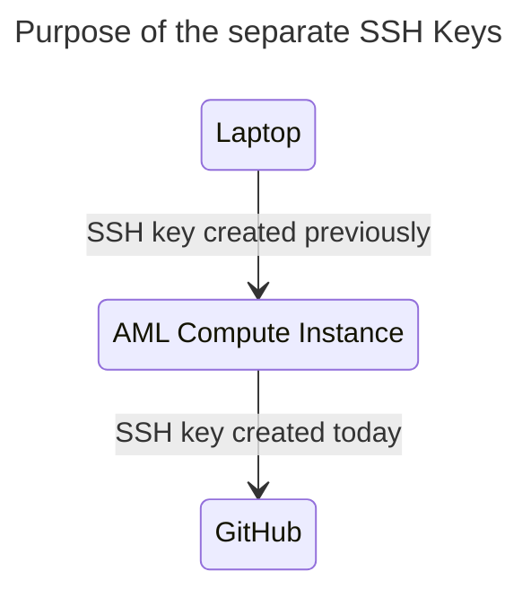

# Git 101 Training Session

## Agenda

1. 15-20 minute lecture
2. Breakout sessions for hands-on exercises

## Prerequisites

- AzureML compute instance training
- Linux 101 training
- Docker 101 training

## Goal

- Clone a repo
- Commit changes to a feature branch
- Make a pull request into main
- Tips on how to fix issues when you screw up (i.e. how to Google the correct things)
- CHR best practices

## Lesson Plan

### 1. Introduction to Git

- What is Git and why do we use it?
  - Git is a distributed version control system.
  - It tracks changes in source code and allows multiple developers to collaborate on a project.
  - Git provides a history of changes and makes it easier to revert back to a previous version or merge different branches.

### 2. Setting up Git and SSH keys

- I already created an SSH key to connect to my compute instance!  Why do I need a different one!?
  - Each SSH key should ideally be used for a specific purpose. Using a separate SSH key for Git ensures better security and separation of concerns. If one key is compromised, it does not immediately grant access to all of your services that use SSH keys.
  - You created an SSH key to connect to your AzureML compute instance from your computer.
  - This SSH key allows connection between your AzureML compute instance and GitHub.

- Connecting to your AzureML compute instance
  - Follow the AzureML compute instance training to set up and connect to your instance.

- Setting up an additional SSH key for Git
  - Generate a new SSH key by running `ssh-keygen -t ed25519 -C "your_email@example.com"` in the terminal.
  - Press "Enter" to accept the default file location, and provide a secure passphrase when prompted.
  - Add the new SSH key to the ssh-agent by running `eval "$(ssh-agent -s)"` and then `ssh-add ~/.ssh/id_ed25519`.
  - Add the new SSH key to your GitHub account by following [these instructions](https://docs.github.com/en/authentication/connecting-to-github-with-ssh/adding-a-new-ssh-key-to-your-github-account).

### 3. Basic Git commands

- Cloning a repository
  - Use `git clone git@github.com:username/repo.git` to clone a repository to your local machine.

- Creating a feature branch
  - Use `git checkout -b feature_branch_name` to create a new branch and switch to it.

- Committing changes
  - Add the changes by using `git add .` or `git add file_name`.
  - Commit the changes with a meaningful message using `git commit -m "Your commit message"`.

- Pushing to the remote repository
  - Push the changes to the remote repository using `git push origin feature_branch_name`.

- Creating a pull request
  - Go to the repository on GitHub and click on the "Pull Requests" tab.
  - Click "New Pull Request" and select your feature branch.
  - Review your changes and click "Create Pull Request".

### 4. Breakout sessions: Hands-on exercise

- Fork this repo
- Clone the forked repo
- Navigate to the cloned directory
- Instantiate flask app with a `docker run ...` command
- Confirm that the app is running by navigating to it with your web browser
- Update source code: add another adjective to the insult
- Create a feature branch
- Commit your change to the feature branch
- Push to the remote repository
- Create a pull request
- Merge into `main`
- Clean up by deleting the feature branch

### 5. Troubleshooting

- Tips on how to fix issues when you screw up:
  - Revert your last commit: If you made a mistake in your last commit, you can use `git revert HEAD` to create a new commit that undoes the changes made in the last commit.
  - Amend a commit message: If you need to modify the last commit message, use `git commit --amend` to edit the message.
  - Reset your local branch to a specific commit: If you want to remove all the changes made after a specific commit, use `git reset --hard <commit-hash>` to reset your branch. Be cautious, as this will permanently delete all changes made after the specified commit.
  - Discard local changes to a specific file: If you have made changes to a file that you want to discard, use `git checkout -- <file>` to discard the local changes.

- Tips for Googling the correct things for solving Git-related issues:
  - Be specific: Include the exact error message or the specific Git command in your search query.
  - Use common keywords: Including keywords such as "git", "error", "issue", "commit", "branch", or "merge" can help narrow down your search results.
  - Look for reliable sources: Official Git documentation, Stack Overflow, GitHub forums, and blog posts from experienced developers are good sources for solutions.
  - Filter search results by recency: If you are facing an issue related to a recent update or release, look for solutions that are posted recently.

## Resources
- [Git official documentation](https://git-scm.com/doc): Comprehensive documentation and reference materials for Git.
- [Git Flight Rules](https://github.com/k88hudson/git-flight-rules): A guide for astronauts (now, programmers using Git) about what to do when things go wrong.
- [Oh Shit, Git!?!](https://ohshitgit.com/): Oh shit, I did something terribly wrong, please tell me git has a magic time machine!?!
- [Relearn Git Every Week](https://www.reddit.com/r/ProgrammerHumor/comments/129q4l9/me_relearning_git_every_week/): How to relearn git every week.
- [GitHub Guides](https://guides.github.com/): A collection of guides on various Git and GitHub topics, including creating repositories, making pull requests, and managing branches.
- [Atlassian Git Tutorials](https://www.atlassian.com/git/tutorials): A series of tutorials covering various aspects of Git, including branching, merging, and undoing changes.
- [Pro Git Book](https://git-scm.com/book/en/v2): A free online book covering all aspects of Git, from basics to advanced topics.
- [Learn Git Branching](https://learngitbranching.js.org/): An interactive web-based tutorial to learn Git branching and other concepts.
- [Git Cheat Sheet](https://education.github.com/git-cheat-sheet-education.pdf): A handy cheat sheet containing common Git commands and their descriptions.
- [Generating a new SSH key and adding it to the ssh-agent](https://docs.github.com/en/authentication/connecting-to-github-with-ssh/generating-a-new-ssh-key-and-adding-it-to-the-ssh-agent): GitHub's guide on generating a new SSH key and adding it to the ssh-agent.
- [Adding a new SSH key to your GitHub account](https://docs.github.com/en/authentication/connecting-to-github-with-ssh/adding-a-new-ssh-key-to-your-github-account): GitHub's guide on adding a new SSH key to your GitHub account.
- [Docker documentation](https://docs.docker.com/): Official documentation for Docker, including getting started guides and reference materials.
- [Flask documentation](https://flask.palletsprojects.com/en/2.1.x/): Official documentation for the Flask web framework, including tutorials and API reference.